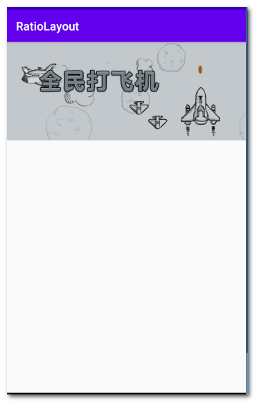

# RatioLayout
图片的屏幕适配，已知宽度,能够动态计算高度，已知高度,能够动态计算宽度

How to
To get a Git project into your build:

Step 1. Add the JitPack repository to your build file

Add it in your root build.gradle at the end of repositories:

	allprojects {
		repositories {
			...
			maven { url 'https://jitpack.io' }
		}
	}
Step 2. Add the dependency

	dependencies {
	        implementation 'com.github.kuang2010:RatioLayout:1.0.1'
	}

Step 3. Add your project

	<com.kuang2010.ratiolayoutlibrary.RatioLayout
		android:layout_width="match_parent"
		android:layout_height="wrap_content"
		app:picRatio="2.43"
		app:relative="relative_width">
		<ImageView
		    android:layout_width="match_parent"
		    android:layout_height="match_parent"
		    android:src="@mipmap/image"/>
    	</com.kuang2010.ratiolayoutlibrary.RatioLayout>
	
	
	
